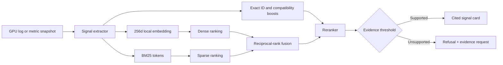

# GPU Signal Atlas

GPU Signal Atlas is a citation-first retrieval-augmented generation (RAG) application for NVIDIA Xid events, DCGM metrics, and GPU observability pipelines. It turns a pasted telemetry sample into a bounded signal card containing documented meaning, evidence to collect next, compatibility cautions, and direct source citations.

The project is intentionally different from a root-cause or remediation agent. It does not query production systems, execute recovery actions, or claim that a single telemetry event proves a cause. Its portfolio focus is corpus design, hybrid retrieval, reranking, citation hygiene, refusal behavior, and measurable evaluation.

## One-line definition

GPU Signal Atlas helps GPU platform engineers explain NVIDIA Xid events and DCGM metric anomalies from version-pinned official documentation and demonstration runbooks in a web application, targeting at least 90% citation validity, Recall@5 above 85%, and p95 local retrieval latency below five seconds.

## What is implemented

- Structure-aware corpus entries for Xids, DCGM fields, GPU Operator, Fluent Bit, and OpenTelemetry
- Exact extraction of Xid identifiers, DCGM metric names, GPU models, and driver branches
- Deterministic 256-dimensional local feature-hash embeddings
- BM25 sparse retrieval
- Reciprocal-rank fusion of dense and sparse ranks
- Exact-identifier, GPU-model, and driver-context boosts
- Reranked top-five retrieval trace
- Cited, template-generated signal cards
- Hard refusal for unknown exact identifiers and unrelated questions
- Compatibility notes for unsupported GPU/driver combinations
- Four interactive browser replays, including a refusal example
- Twenty-five-case retrieval and refusal evaluation
- Node test suite, type checking, production build, and GitHub Actions CI
- Optional Fluent Bit → OTLP → OpenTelemetry Collector replay configuration

## Architecture



Detailed diagrams and decisions are in [`docs/ARCHITECTURE.md`](docs/ARCHITECTURE.md) and [`docs/VISUAL_GUIDE.md`](docs/VISUAL_GUIDE.md).

## Quick start

Requirements: Node.js 22.13 or later.

```bash
git clone https://github.com/sivalinb/gpu-signal-atlas.git
cd gpu-signal-atlas
npm install
npm test
npm run evaluate
npm run dev
```

Open `http://localhost:3000`.

Analyze a sample from the command line:

```bash
npm run analyze -- "Xid 79 DCGM_FI_DEV_PCIE_REPLAY_COUNTER=184 H100 R565"
```

See [`docs/LOCAL_TESTING.md`](docs/LOCAL_TESTING.md) for the complete verification procedure and optional observability replay.

## Evaluation snapshot

The checked-in evaluation contains 25 independent cases across exact identifiers, semantic symptoms, multi-source retrieval, and deliberately unsupported inputs.

| Metric | Result | Target |
|---|---:|---:|
| Recall@5 | 100.0% | ≥85% |
| Mean reciprocal rank | 0.931 | ≥0.80 |
| Citation validity | 100.0% | ≥90% |
| Refusal precision | 100.0% | ≥90% |
| Refusal recall | 100.0% | ≥90% |
| Local p95 retrieval latency | 4.96 ms | <5 s |

These results validate the checked-in deterministic corpus and queries. They are regression evidence, not generalized GPU-diagnostic accuracy. Full methodology is in [`docs/EVALUATION_REPORT.md`](docs/EVALUATION_REPORT.md).

## Repository map

```text
app/                         interactive Vinext/React demo
components/ui/               shadcn interface primitives
core/
  corpus.ts                  curated evidence chunks
  engine.ts                  extraction, embedding, BM25, fusion, reranking, generation
  samples.ts                 browser replay inputs
  types.ts                   public data contracts
evaluation/cases.ts          independent query expectations
tests/engine.test.ts         unit, retrieval, safety, and regression tests
scripts/analyze.ts           command-line analysis
scripts/evaluate.ts          reproducible evaluation runner
observability/               Fluent Bit and OTel Collector replay configs
examples/gpu-events.log      synthetic, labeled GPU telemetry replay
docs/                        design, visual, evaluation, testing, and submission documentation
```

## Honest boundaries

- The included telemetry is synthetic and labeled as replay data.
- The local embedding is deterministic and credential-free; it is not a claim of state-of-the-art semantic quality.
- Template generation is used so every sentence can be traced to retrieved corpus fields.
- Official documents are paraphrased into compact curated records; source URLs remain the authority.
- The application does not issue resets, drains, restarts, reboots, or Kubernetes writes.
- A real GPU is not required for the evaluated project.
- Before production use, pin the complete source corpus to approved versions and add organization-specific change-control rules.

## Documentation index

- [`docs/PROBLEM_AND_SOLUTION.md`](docs/PROBLEM_AND_SOLUTION.md) — detailed problem statement, users, scope, and solution
- [`docs/ARCHITECTURE.md`](docs/ARCHITECTURE.md) — component design, retrieval mathematics, data contracts, and decisions
- [`docs/VISUAL_GUIDE.md`](docs/VISUAL_GUIDE.md) — illustrated end-to-end flow and code map
- [`docs/DATASET_AND_PROMPTS.md`](docs/DATASET_AND_PROMPTS.md) — corpus, freshness, chunking, generation instructions, and iterations
- [`docs/EVALUATION_REPORT.md`](docs/EVALUATION_REPORT.md) — query set, metrics, results, and failure analysis
- [`docs/LOCAL_TESTING.md`](docs/LOCAL_TESTING.md) — local setup and end-to-end verification
- [`docs/RUNBOOKS.md`](docs/RUNBOOKS.md) — demonstration evidence-collection runbooks
- [`docs/DEMO_SCRIPT.md`](docs/DEMO_SCRIPT.md) — five-minute video walkthrough
- [`docs/PROJECT_DOCUMENTATION.md`](docs/PROJECT_DOCUMENTATION.md) — submission-ready project narrative

## License

MIT. The NVIDIA, Fluent Bit, and OpenTelemetry documentation linked by the corpus remains under its respective owners and licenses.
