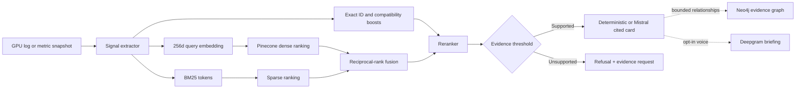

# GPU Signal Atlas

GPU Signal Atlas is an evidence-first GPU observability and performance-intelligence product. Its citation-first RAG path turns NVIDIA Xid events and DCGM metrics into bounded signal cards; its performance workbench turns public or imported inference benchmark results into SLO checks, telemetry correlations, topology/MIG review, capacity scenarios, and exportable architecture evidence.

The project is intentionally different from a root-cause or remediation agent. It does not query production systems, execute recovery actions, or claim that a single telemetry event proves a cause. Its portfolio focus is corpus design, hybrid retrieval, reranking, citation hygiene, refusal behavior, and measurable evaluation.


The product homepage summarizes the core promise visually: opaque GPU telemetry passes through observable log, trace, retrieval, and evidence layers before it becomes cited human decision support. The illustration is conceptual product communication; the live analyzer, retrieval trace, citations, refusal behavior, and evaluation sections provide the inspectable implementation evidence.

## One-line definition

GPU Signal Atlas helps GPU platform engineers explain NVIDIA Xid events and DCGM metric anomalies from reviewed official-documentation snapshots and demonstration runbooks in a web application, targeting at least 90% citation validity, Recall@5 above 85%, and p95 local retrieval latency below five seconds.

## What is implemented

- Structure-aware corpus entries for Xids, DCGM fields, GPU Operator, Fluent Bit, and OpenTelemetry
- Exact extraction of Xid identifiers, DCGM metric names, GPU models, and driver branches
- Deterministic 256-dimensional feature-hash embeddings
- Pinecone serverless dense retrieval in a versioned corpus namespace
- Checked-in precomputed index retained as the offline regression and ablation baseline
- BM25 sparse retrieval
- Reciprocal-rank fusion of dense and sparse ranks
- Exact-identifier, GPU-model, and driver-context boosts
- Reranked top-five retrieval trace
- Cited, template-generated signal cards
- Optional schema-constrained OpenAI-compatible generator with post-generation claim grounding
- Hard refusal for unknown identifiers, unrelated questions, and unsupported same-domain telemetry
- Compatibility notes for unsupported GPU/driver combinations
- Four interactive browser replays, including a refusal example
- Thirty-one-case retrieval, claim-grounding, and refusal evaluation
- Retrieval and chunking ablations covering BM25, vector, RRF, reranking, fixed windows, and structure-aware records
- Allow-listed ingestion, HTML cleaning, source fingerprinting, and freshness-SLA gates
- Node test suite, type checking, production build, and GitHub Actions CI
- Optional Fluent Bit → OTLP → OpenTelemetry Collector replay configuration
- Token-gated OTLP/JSON telemetry gateway with payload bounds, metadata allow-listing, inline redaction, and a 15-minute in-memory buffer
- Reconnecting Server-Sent Events inbox with a labeled HTTPS short-poll fallback for stream-buffering edge hosts
- Governed You.com source discovery with domain allow-listing and a mandatory review queue
- LangSmith OTLP trace export with raw-telemetry redaction and fail-open behavior
- Optional Mistral strict-schema generation plus a trained-embedding ablation that does not mutate Pinecone
- Neo4j Aura evidence graph with idempotent synchronization and bounded, read-only public paths
- Opt-in Deepgram voice transcription and grounded spoken briefings through server-only routes
- Interactive benchmark baseline/candidate comparison using attributable public NVIDIA GenAI-Perf example data
- TTFT, inter-token latency, request latency, output throughput, GPU power, utilization, memory, and SLO decision views
- Derived benchmark-to-telemetry correlation timeline mapping AIPerf/GenAI-Perf, Triton, DCGM, OpenTelemetry, and LangSmith
- Fleet/MIG readiness and passive-health versus active-diagnostics safety workflow
- Headroom-aware GPU capacity and editable cost-scenario calculator
- Downloadable JSON evidence report plus browser print-to-PDF workflow
- Public benchmark listing and server-side comparison APIs

## Architecture



Detailed diagrams and decisions are in [`docs/ARCHITECTURE.md`](docs/ARCHITECTURE.md) and [`docs/VISUAL_GUIDE.md`](docs/VISUAL_GUIDE.md).

## Quick start

Requirements: Node.js 22.13 or later.

```bash
git clone https://github.com/sivalinb/gpu-signal-atlas.git
cd gpu-signal-atlas
npm install
npm test
npm run evaluate
npm run ablate
npm run pinecone:sync
npm run evaluate:pinecone
npm run dev
```

Open `http://localhost:3000`.

The website and Pinecone evaluation require the four Pinecone server-only variables shown in `.env.example`. You.com, LangSmith, Mistral, Neo4j, and Deepgram are independently optional for local installations. The CLI, unit tests, local evaluation, and core ablations remain credential-free.

The public `/api/integrations` route exposes safe configuration state only. It explicitly reports that no provider secret is exposed to the browser.

Analyze a sample from the command line:

```bash
npm run analyze -- "Xid 79 DCGM_FI_DEV_PCIE_REPLAY_COUNTER=184 H100 R565"
```

See [`docs/LOCAL_TESTING.md`](docs/LOCAL_TESTING.md) for the complete verification procedure and optional observability replay.

Start at the product homepage for the Observe → Retrieve → Explain → Decide mental model. Then run the interactive **Visual demo** section to watch ingestion, cleaning, chunking, indexing, extraction, retrieval, reranking, evidence gating, and generation advance one stage at a time. Run **Telemetry → Run end-to-end flow** to see a synthetic GPU signal pass through Fluent Bit, OpenTelemetry, the sanitizer, browser inbox, analyzer, Pinecone/BM25 retrieval, evidence gate, and redacted LangSmith trace. Live mode uses SSE directly and clearly reports an HTTPS polling fallback if the hosting edge buffers streams.

Open **Performance** in the main navigation for the solution-architecture workflow. Compare the bundled public NVIDIA benchmark runs, inspect SLO decisions, visualize how benchmark and telemetry systems align, review a safe MIG/diagnostics workflow, edit a headroom/cost scenario, and export the evidence report. Public measurements and derived scenarios are labeled separately throughout the interface.

## Evaluation snapshot

The checked-in evaluation contains 31 independent cases across exact identifiers, semantic symptoms, multi-source retrieval, deliberately unsupported inputs, and six adversarial same-domain negatives.

| Metric | Result | Target |
|---|---:|---:|
| Recall@5 | 100.0% | ≥85% |
| Mean reciprocal rank | 0.931 | ≥0.80 |
| Citation validity | 100.0% | ≥90% |
| Claim grounding | 100.0% | 100% |
| Refusal precision | 100.0% | ≥90% |
| Refusal recall | 100.0% | ≥90% |
| Local p95 retrieval latency | 0.92 ms | <5 s |
| Pinecone p95 end-to-end retrieval latency | 518.05 ms | <5 s |

These results validate the checked-in deterministic corpus and queries. They are regression evidence, not generalized GPU-diagnostic accuracy. Full methodology is in [`docs/EVALUATION_REPORT.md`](docs/EVALUATION_REPORT.md).

## Repository map

```text
app/                         interactive Vinext/React demo
components/ui/               shadcn interface primitives
core/
  corpus.ts                  curated evidence chunks
  engine.ts                  extraction, embedding, BM25, fusion, reranking, generation
  pinecone.ts                server-only query, upsert, metadata, and index validation
  generated/vector-index.ts persistent precomputed document vectors
  ingestion.ts               cleaning, fingerprint, source validation, freshness logic
  llm.ts                     optional strict-schema model adapter
  you.ts                     allow-listed You.com discovery and review candidates
  langsmith.ts               redacted OpenTelemetry trace export
  mistral.ts                 provider configuration and embedding comparison
  neo4j.ts                   evidence-graph synchronization and bounded queries
  deepgram.ts                opt-in speech-to-text and text-to-speech adapters
  telemetry.ts               OTLP normalization, sanitization, bounded buffer
  benchmark.ts               public run provenance, SLOs, comparisons, capacity, reports
  ablation.ts                retrieval and chunking comparison primitives
  samples.ts                 browser replay inputs
  types.ts                   public data contracts
evaluation/cases.ts          independent query expectations
tests/engine.test.ts         unit, retrieval, safety, and regression tests
scripts/analyze.ts           command-line analysis
scripts/evaluate.ts          reproducible evaluation runner
scripts/evaluate-pinecone.ts live managed-index evaluation runner
scripts/sync-pinecone.ts     reviewed-corpus Pinecone promotion workflow
scripts/sync-neo4j.ts        idempotent evidence-graph synchronization
scripts/evaluate-mistral-embeddings.ts trained-vs-local embedding ablation
scripts/ablate.ts            retrieval and chunking ablation report
scripts/ingest-source.ts     allow-listed source snapshot workflow
scripts/discover-you-sources.ts You.com review-candidate workflow
observability/               Fluent Bit and OTel Collector replay configs
app/api/telemetry/           token-gated ingest, replay, recent, and SSE routes
app/api/benchmarks/          public run catalog and comparison report routes
app/api/graph/               bounded, read-only Neo4j relationship route
app/api/voice/               bounded Deepgram transcription and speech routes
examples/gpu-events.log      synthetic, labeled GPU telemetry replay
docs/                        design, visual, evaluation, testing, and submission documentation
```

## Honest boundaries

- The included telemetry is synthetic and labeled as replay data.
- The bundled benchmark numbers reproduce a public NVIDIA documentation example. Because that example omits the GPU model, full configuration, repetitions, and confidence interval, the application never presents it as a hardware purchasing benchmark.
- Correlation, capacity, fleet, and cost views are explicitly derived demonstration scenarios until connected to a target environment.
- The feature-hash embedding is deterministic and reproducible; Pinecone manages storage and similarity search but does not make the representation state of the art.
- The public website queries Pinecone only from a server route. No Pinecone credential is included in browser JavaScript.
- You.com receives public documentation discovery queries only; results cannot write to the corpus or Pinecone automatically.
- LangSmith receives redacted identifiers, ranks, timings, and outcomes; the raw pasted telemetry string is excluded by default.
- Mistral receives extracted identifiers and reviewed evidence rather than the original raw telemetry; its output must pass the same strict schema and grounding validator.
- Neo4j stores reviewed relationships and benchmark summaries, not high-frequency telemetry or raw logs.
- Deepgram is invoked only after explicit record/listen actions; this app does not persist audio.
- Public analysis and voice routes intentionally have no browser challenge; production scale should add platform rate limits, authentication, quotas, and provider-cost controls without blocking the core demo.
- The public replay endpoint accepts only checked-in synthetic samples. External OTLP writes require `TELEMETRY_INGEST_TOKEN`, have a 64 KiB body limit, and expose only allow-listed metadata after redaction.
- The telemetry inbox is a short-lived demonstration buffer, not a durable log backend; multi-instance production deployments should replace it with a tenant-isolated event bus or short-retention store.
- Template generation is used so every sentence can be traced to retrieved corpus fields.
- Official documents are paraphrased into compact curated records; source URLs remain the authority.
- Every record exposes its review date, rolling/snapshot source status, source section, and deterministic curated-content fingerprint.
- The application does not issue resets, drains, restarts, reboots, or Kubernetes writes.
- A real GPU is not required for the evaluated project.
- Before production use, pin the complete source corpus to approved versions and add organization-specific change-control rules.

## Documentation index

- [`docs/PROBLEM_AND_SOLUTION.md`](docs/PROBLEM_AND_SOLUTION.md) — detailed problem statement, users, scope, and solution
- [`docs/ARCHITECTURE.md`](docs/ARCHITECTURE.md) — component design, retrieval mathematics, data contracts, and decisions
- [`docs/VISUAL_GUIDE.md`](docs/VISUAL_GUIDE.md) — illustrated end-to-end flow and code map
- [`docs/DATASET_AND_PROMPTS.md`](docs/DATASET_AND_PROMPTS.md) — corpus, freshness, chunking, generation instructions, and iterations
- [`docs/EVALUATION_REPORT.md`](docs/EVALUATION_REPORT.md) — query set, metrics, results, and failure analysis
- [`docs/ABLATION_REPORT.md`](docs/ABLATION_REPORT.md) — retrieval and chunking comparisons
- [`docs/INGESTION_AND_FRESHNESS.md`](docs/INGESTION_AND_FRESHNESS.md) — source refresh and human-review workflow
- [`docs/TELEMETRY_LIVE_FLOW.md`](docs/TELEMETRY_LIVE_FLOW.md) — implemented Collector-to-browser gateway, SSE contract, safeguards, and extension points
- [`docs/LLM_MODE.md`](docs/LLM_MODE.md) — optional model contract and grounding boundary
- [`docs/YOU_LANGSMITH_INTEGRATION.md`](docs/YOU_LANGSMITH_INTEGRATION.md) — discovery, AI observability, privacy, and scale-out design
- [`docs/MULTIMODAL_EVIDENCE_FABRIC.md`](docs/MULTIMODAL_EVIDENCE_FABRIC.md) — Mistral, Neo4j, and Deepgram flows, controls, and extension design
- [`docs/PERFORMANCE_INTELLIGENCE.md`](docs/PERFORMANCE_INTELLIGENCE.md) — public benchmark data, technology mapping, SLOs, correlation, MIG, capacity, APIs, and production extension
- [`docs/NVIDIA_INTERVIEW_DEMO.md`](docs/NVIDIA_INTERVIEW_DEMO.md) — focused solution-architecture interview walkthrough and follow-up answers
- [`docs/LOCAL_TESTING.md`](docs/LOCAL_TESTING.md) — local setup and end-to-end verification
- [`docs/RUNBOOKS.md`](docs/RUNBOOKS.md) — demonstration evidence-collection runbooks
- [`docs/DEMO_SCRIPT.md`](docs/DEMO_SCRIPT.md) — five-minute video walkthrough
- [`docs/PROJECT_DOCUMENTATION.md`](docs/PROJECT_DOCUMENTATION.md) — submission-ready project narrative
- [`docs/WEEK2_REVIEW.md`](docs/WEEK2_REVIEW.md) — expert requirement mapping and 98/100 technical scorecard
- [`docs/SUBMISSION_CHECKLIST.md`](docs/SUBMISSION_CHECKLIST.md) — public links, recording sequence, and final handoff checks

## License

MIT. The NVIDIA, Fluent Bit, and OpenTelemetry documentation linked by the corpus remains under its respective owners and licenses.
