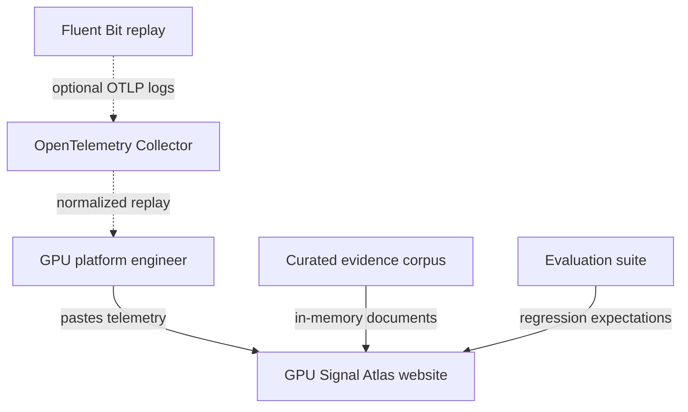
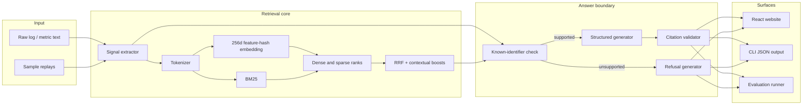
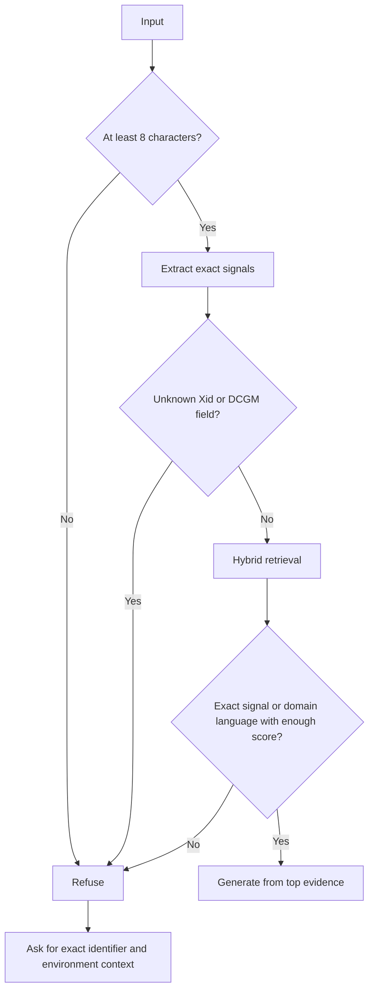

# Architecture and Design

## System context



The evaluated application is self-contained in the browser and command line. The Fluent Bit and OpenTelemetry files demonstrate how the same log shape can enter a real observability pipeline; they are not required for retrieval tests.

## Component architecture



## Data model

Each corpus entry is a structure-aware chunk:

```ts
interface CorpusDocument {
  id: string;
  title: string;
  source: string;
  sourceUrl: string;
  authority: 'official' | 'internal';
  signalTypes: ('xid' | 'metric' | 'pipeline' | 'runbook')[];
  identifiers: string[];
  gpuModels: string[];
  driverBranches: string[];
  updated: string;
  content: string;
  documentedMeaning: string;
  nextEvidence: string[];
  limitations: string[];
}
```

This model is deliberately richer than a plain text chunk. Exact identifiers drive retrieval, while the three answer fields restrict generation to reviewed content.

## Retrieval design

### Tokenization

The tokenizer lowercases text, preserves underscores and telemetry punctuation, and removes one-character noise. A name such as `DCGM_FI_DEV_GPU_TEMP` remains one searchable token.

### Local embedding

The embedding stage creates a 256-dimensional deterministic feature-hash vector:

1. Generate unigram and adjacent-bigram features.
2. Hash each feature with FNV-1a.
3. Select a vector bucket and signed direction from the hash.
4. Apply logarithmic term-frequency weighting.
5. L2-normalize the vector.

The result is local, reproducible, and suitable for demonstrating vector retrieval without secrets. It is best understood as a retrieval baseline rather than a semantic-model substitute.

### BM25

For query term `q` in document `d`, the implementation uses:

```text
IDF(q) × TF(q,d) × (k1 + 1)
────────────────────────────────────
TF(q,d) + k1 × (1 - b + b × |d|/avgdl)
```

with `k1 = 1.5` and `b = 0.75`.

### Rank fusion

Dense cosine ranks and BM25 ranks are combined using reciprocal-rank fusion:

```text
RRF(d) = 1 / (60 + sparse_rank(d)) + 1 / (60 + dense_rank(d))
```

The system then adds bounded terms for:

- exact Xid or DCGM identifier matches;
- matching GPU model;
- matching driver branch;
- normalized lexical score; and
- normalized vector similarity.

Scores are ranking features, not probabilities. UI confidence is a bounded presentation score based on the top result and exact-match coverage.

## Refusal design



The refusal response intentionally contains no citations because no evidence cleared the answer boundary.

## Citation contract

A citation is valid only when:

1. its document ID exists in the corpus;
2. the same ID appears in the current retrieval result; and
3. its URL is taken directly from that corpus record.

The evaluation runner checks this contract for every generated citation.

## Compatibility behavior

When an input names a GPU model or driver branch and the selected document contains a restricted applicability list, the response adds a compatibility note if there is no overlap. It does not remove the source because the identifier may still be useful; it marks the uncertainty for operator review.

## Website design

The website is a working surface, not a marketing landing page. The first viewport contains:

- sample selectors;
- a raw telemetry editor;
- the analysis action;
- a live retrieval trace; and
- the full cited answer or refusal.

The graphite and mint visual system references telemetry terminals, signal traces, and evidence highlighting. The primary green is reserved for grounded/active information; amber indicates uncertainty or refusal.

## Security and privacy

- Analysis runs locally in the browser for the deployed demonstration.
- No input is persisted or transmitted to a model provider.
- No secret is included in the repository.
- External links are static authoritative documentation URLs.
- Observability configuration outputs to localhost only.
- CI requires tests, evaluation, type checking, and a production build.

## Key design decisions

| Decision | Reason | Tradeoff |
|---|---|---|
| Deterministic local embedding | Credential-free, reproducible evaluation | Weaker semantic generalization than a trained model |
| Structured corpus records | Exact identifiers and bounded generation | Manual curation effort |
| RRF rather than raw-score mixing | Dense and sparse scores have different scales | Rank positions lose some score magnitude |
| Template generation | Complete citation traceability | Less conversational flexibility |
| Hard unknown-ID refusal | Prevents adjacent-identifier hallucination | Cannot answer new identifiers until corpus refresh |
| Browser-resident corpus | Private, instant demo | Not appropriate for a large enterprise corpus |

## Replacement boundaries

The following functions form stable seams:

- `embed(text)` can be replaced by a provider or local sentence transformer.
- `retrieve(query)` can call Qdrant, OpenSearch, or another hybrid index.
- `analyzeTelemetry(query)` can pass validated evidence to an LLM JSON-schema generator.
- The `SignalAnalysis` interface can remain unchanged across those upgrades.
