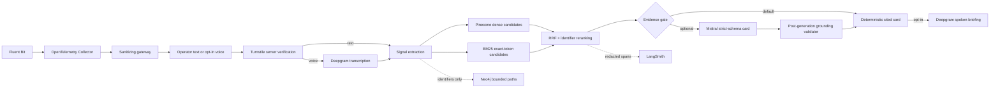

# Multimodal Evidence Fabric

## Product outcome

GPU Signal Atlas now supports protected public analysis, optional grounded model generation, a relationship graph, and voice interaction while preserving its citation-first safety boundary. These integrations are additive: Pinecone remains the reviewed text-evidence store, BM25 remains the exact-identifier path, and deterministic generation remains the default.

## End-to-end flow



## Responsibility and data contract

| Technology | Responsibility | Receives | Returns or stores | Explicit boundary |
|---|---|---|---|---|
| Fluent Bit | Tail and enrich GPU/Kubernetes logs | Log records | OTLP logs | No diagnosis or vector indexing |
| OpenTelemetry | Normalize resource identity and transport logs/traces | OTLP telemetry | Logs plus redacted spans | Not a corpus or reasoning engine |
| Turnstile | Protect costly public AI/voice routes | Single-use browser token, remote IP | Verification result | Secret validation is server-side; tokens expire and are single use |
| Pinecone | Serve reviewed semantic evidence | Query vector | Ranked reviewed chunks | Does not store submitted GPU logs |
| BM25 | Preserve exact Xids and DCGM field names | Tokenized query and corpus | Sparse ranks | Application-local, deterministic |
| Mistral | Optional structured generation and trained-embedding ablation | Extracted identifiers and retrieved evidence | Strict JSON signal card or vectors | Never receives the original raw telemetry; deterministic mode remains default |
| Neo4j Aura | Expose explainable relationships | Reviewed evidence metadata, identifiers, benchmark summaries | Bounded graph paths | No raw logs, secrets, or high-frequency metrics |
| Deepgram | Add opt-in voice input and output | Audio after Stop, or grounded briefing text | Transcript or MP3 | No background recording; audio is not persisted by this app |
| LangSmith | Observe and evaluate the RAG pipeline | Redacted span attributes | Traces and quality signals | Raw telemetry is excluded |
| You.com | Discover public documentation candidates | Allow-listed documentation query | Pending-review records | Cannot promote content or write Pinecone |

## Implemented paths

### Protected analysis

The browser renders Cloudflare Turnstile with the public site key. `/api/analyze`, `/api/voice/transcribe`, and `/api/voice/speak` submit the resulting token to the server. The server calls Siteverify, validates the action and deployment hostname, and rejects missing, invalid, expired, or replayed tokens. The Turnstile secret is never included in browser JavaScript.

### Grounded Mistral mode

The analyzer exposes **Deterministic evidence template** and **Mistral structured output** modes. Retrieval and refusal run before any model request. Mistral receives only extracted Xids, metrics, GPU models, driver branches, and the already-grounded draft/evidence. The existing schema parser and claim-grounding validator must accept every field; otherwise the route fails closed with a safe error. `npm run ablate:mistral` compares `mistral-embed` retrieval with the checked-in deterministic embedding without changing the production Pinecone namespace.

### Neo4j evidence graph

`npm run neo4j:sync` uses idempotent `MERGE` statements to create Evidence, Signal, BenchmarkRun, Model, ServingBackend, and Technology nodes plus their relationships. The public graph route issues one read-only, ordered query with a hard limit of 40 records. The website renders at most 12 paths and labels them as relationship evidence. Pinecone answers semantic similarity; Neo4j answers how known entities are connected. Neither replaces the other.

### Deepgram voice interaction

**Record question** requests microphone permission only after a click, records locally, and uploads at most 5 MiB after **Stop**. The server sends that one audio body to Deepgram Nova and returns the transcript to the editable analyzer input. **Listen to briefing** sends a bounded, citation-grounded result summary to Deepgram Aura and plays the returned MP3. The app does not retain audio or transcripts outside the current page state.

## Security and operational controls

- All permanent credentials are server-only environment variables.
- `/api/integrations` exposes booleans, models, and the public Turnstile site key only.
- Turnstile is an abuse-control signal, not authentication or authorization.
- Provider requests have timeouts, size bounds, and safe error messages.
- Mistral failures do not silently fall back; the operator can explicitly choose deterministic mode.
- Neo4j synchronization is an operator workflow, not a request-time write.
- Graph reads are bounded and cacheable; benchmark time series still belong in an analytical/time-series store.
- Deepgram use is visibly opt-in and browser microphone permission is required.

## Local configuration and verification

Copy `.env.example` to `.env.local`, populate only the providers you want, leave `TURNSTILE_ENFORCED=false` for ordinary local development, then run:

```bash
npm run neo4j:sync
npm run ablate:mistral
npm test
npm run typecheck
npm run lint
npm run build
npm run dev
```

For a local Turnstile test, use Cloudflare's documented test keys or add `localhost` to a development widget. Never reuse the production secret in browser code. Verify `/api/integrations`, run an Xid sample in both generation modes, refresh the graph, record a short question, and play the result briefing.

## Production extension

For a larger corpus, keep immutable source snapshots in object storage, enqueue changed documents, use structure-aware chunking, generate embeddings in batches, synchronize a staging Pinecone namespace, and promote only after retrieval/citation regression. Expand Neo4j with stable incident, service, cluster, GPU/MIG, benchmark-run, model-revision, and change-event identities. Store logs in Loki/OpenSearch, metrics in Prometheus/Mimir, traces in Tempo/Jaeger, and benchmark facts in PostgreSQL/ClickHouse; link them with OpenTelemetry resource attributes and durable run IDs. Pinecone and Neo4j then operate as derived evidence indexes, not systems of record.

## Source references

- [Cloudflare Turnstile server-side validation](https://developers.cloudflare.com/turnstile/get-started/server-side-validation/)
- [Mistral chat completion API](https://docs.mistral.ai/api/endpoint/chat)
- [Mistral embeddings API](https://docs.mistral.ai/api/endpoint/embeddings)
- [Deepgram streaming speech-to-text](https://developers.deepgram.com/reference/speech-to-text/listen-streaming)
- [Deepgram streaming text-to-speech](https://developers.deepgram.com/reference/text-to-speech/speak-streaming)
- [Neo4j Query API](https://neo4j.com/docs/query-api/current/)
- [Neo4j GraphRAG guide](https://neo4j.com/docs/neo4j-graphrag-python/current/user_guide_rag.html)
