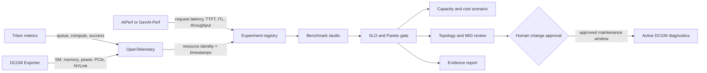

# GPU performance intelligence

## Product purpose

GPU Signal Atlas now joins two workflows that are commonly separated:

1. **Reliability evidence:** explain Xid events and DCGM signals without claiming that one event proves root cause.
2. **Performance evidence:** turn reproducible inference benchmark results into SLO, topology, capacity, and promotion decisions.

The performance workbench is designed for solution architecture conversations. It connects workload behavior, serving metrics, GPU telemetry, topology, cost assumptions, and an explicit change gate in one reviewable evidence package.

## Public dataset

The checked-in reference runs reproduce the three rows in NVIDIA's public **GenAI-Perf Analyze summary report** example:

- GPT-2 through Triton + vLLM
- concurrency `1`
- input sequence length `201`
- dataset entry sweeps of `100`, `150`, and `200`
- p99 TTFT, p99 inter-token latency, p99 request latency, output-token throughput, request throughput, GPU power, energy, utilization, and memory

Source: [NVIDIA GenAI-Perf Analyze example summary report](https://github.com/triton-inference-server/perf_analyzer/blob/main/genai-perf/docs/analyze.md#summary-report-csv). The source repository is Apache-2.0 licensed.

Important limitation: the documentation example does not report the GPU model, full server configuration, repetitions, or confidence interval. The website therefore labels these records as **public demonstration measurements**, never as H100/H200/B200 performance or a purchasing benchmark.

The public Performance Lab now exposes that incompleteness as a reproducibility gate. Promotion requires GPU SKU and count, topology and MIG profile, model revision, precision/quantization, tensor/pipeline parallelism, backend and container versions, CUDA/driver/firmware, input/output token distributions, concurrency or request-rate sweep, warmup, repetitions, variance/confidence interval, exact command, errors/timeouts, power/thermal conditions, and an immutable raw-artifact URI.

## Evidence classes

| Class | Meaning | Used for |
|---|---|---|
| Public measurement | Values copied from an attributable public benchmark output | Baseline/candidate comparison and SLO checks |
| Derived scenario | Deterministic calculation or illustrative time series | Correlation teaching view, headroom, capacity, and cost |
| Live measurement | A future AIPerf/GenAI-Perf + OTel + DCGM capture from a target environment | Production architecture validation |

The interface names the evidence class at the point of use. A derived scenario cannot silently become a measured claim.

## Technology map



### Responsibilities

- **AIPerf:** current NVIDIA benchmarking path for generative AI endpoints. It exports aggregated and per-request artifacts and supports sweeps.
- **GenAI-Perf:** source of the bundled public example; its output vocabulary includes TTFT, ITL, request latency, output-token throughput, and GPU telemetry. NVIDIA now recommends migration to AIPerf for new work.
- **Triton Inference Server:** contributes queue, request, compute, and server-side performance metrics.
- **DCGM Exporter:** contributes passive GPU telemetry. These metrics support correlation; they do not identify a kernel-level root cause by themselves.
- **OpenTelemetry:** supplies common resource identity and timestamps so benchmark requests, server spans, logs, and GPU metrics can be aligned.
- **GPU Operator / MIG Manager:** exposes node labels and partition state for topology-aware recommendations. MIG changes require workload and change-control coordination.
- **LangSmith:** continues to observe the RAG evidence path. It is not the time-series database for GPU performance metrics.
- **Pinecone:** continues to store reviewed textual evidence for the diagnostic RAG path. Numeric benchmark runs belong in structured experiment storage, not in the vector database.

## Workbench views

### Benchmark studio

Select a baseline and candidate. The core calculates percentage deltas without hiding metric direction:

- lower is better for TTFT, ITL, request latency, and power;
- higher is better for throughput;
- configured SLO checks remain individually inspectable.

A passing SLO recommends a repeated target-stack benchmark. It never recommends production promotion from one documentation sample.

### Signal correlation

The timeline shows where AIPerf/GenAI-Perf, Triton, DCGM, OpenTelemetry, and LangSmith connect. The bundled series is explicitly labeled derived. A production implementation should join events by:

- benchmark ID and run ID;
- model and model revision;
- Kubernetes cluster, namespace, pod, and node;
- GPU UUID or MIG instance identity;
- synchronized event timestamps;
- serving configuration fingerprint.

### Fleet and MIG

The sample node cards demonstrate the intended contract. A real adapter should read Kubernetes inventory, GPU Operator labels, DCGM health, and workload ownership. Passive health is safe to observe continuously. Active diagnostics are invasive and must be initiated only after draining work and receiving change approval.

### Capacity planner

The calculation is:

```text
safe capacity per GPU = measured request throughput × (1 - headroom percentage)
required GPUs = ceiling(target request rate / safe capacity per GPU)
monthly estimate = required GPUs × hourly cost × 730
```

It is a scenario tool, not a quote. Replace the bundled reference run and editable price with measurements and pricing for the target model, hardware, precision, region, and serving configuration.

### Decision report

The browser downloads JSON containing the selected runs, SLO decisions, provenance, recommendation, capacity scenario, and safety boundary. **Print / PDF** uses the browser's print-to-PDF path for a human-readable architecture review artifact.

## APIs

### List benchmark evidence

```http
GET /api/benchmarks
```

Returns public runs, provenance, and the default demonstration SLO. The response is public-cacheable for one hour.

### Compare two runs

```http
POST /api/benchmarks/compare
Content-Type: application/json

{
  "baselineId": "gpt2-config-100",
  "candidateId": "gpt2-config-200"
}
```

Returns deltas, SLO checks, provenance, a bounded recommendation, and a safety statement.

## Extending to real data

1. Run AIPerf sweeps with fixed prompts, model revision, endpoint, concurrency/rate range, warmup, repetitions, and random seed.
2. Persist raw AIPerf artifacts in object storage and normalized run metadata/metrics in an experiment database.
3. Scrape Triton and DCGM Exporter through the OpenTelemetry Collector or a Prometheus-compatible backend.
4. Propagate benchmark/run identifiers as resource attributes.
5. Calculate confidence intervals and mark unstable runs before ranking.
6. Add hardware-specific price, energy, and carbon inputs only from approved sources.
7. Require an architecture owner to approve topology, MIG, and active-diagnostic actions.

Suggested production storage:

- object storage for immutable raw benchmark artifacts;
- PostgreSQL/ClickHouse for experiment metadata and numeric comparisons;
- Prometheus/Mimir for operational time series;
- Tempo/Jaeger for traces;
- Loki/OpenSearch for logs;
- Pinecone for semantic retrieval over reviewed textual evidence and prior decision narratives.

## Validation

`tests/benchmark.test.ts` verifies provenance, metric positivity, deterministic SLO evaluation, delta direction, capacity headroom, and report safety boundaries. The normal project commands validate the feature:

```bash
npm test
npm run typecheck
npm run build
```
