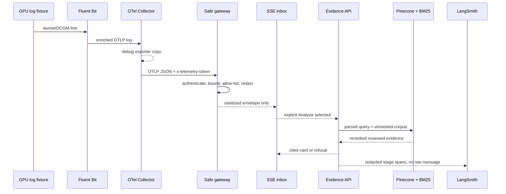

# Live Telemetry Flow

## Purpose

The live telemetry path turns the earlier manual copy/paste boundary into an inspectable, safety-bounded integration. It is designed to demonstrate how GPU events can move from collection to an evidence-backed RAG decision without turning the website into an unauthenticated log sink or automatically diagnosing every event.

## End-to-end flow



## Technology responsibility

| Component | Technology | Responsibility | Data leaving component |
|---|---|---|---|
| GPU source | Synthetic NVIDIA Xid/DCGM fixture | Produce a labeled replay signal | One text log record |
| Collector agent | Fluent Bit | Tail, parse, and enrich the record | OTLP log plus service metadata |
| Telemetry router | OpenTelemetry Collector | Receive, normalize, batch, debug, and fan out | OTLP JSON to localhost gateway |
| Safety boundary | Vinext server route + `core/telemetry.ts` | Authenticate, validate, sanitize, and retain briefly | Browser-safe `TelemetryEvent` |
| Live transport | Server-Sent Events + labeled HTTPS fallback | Reconnectable one-way delivery across streaming and buffering hosts | Sanitized envelope only |
| Operator surface | React telemetry inbox | Display arrivals and require an explicit analysis decision | Selected sanitized message |
| Evidence service | Same-origin analyzer route | Extract exact signals and coordinate retrieval/gating | Query vector and tokens |
| Evidence store | Pinecone + BM25 + RRF | Retrieve reviewed documentation, never raw logs | Top reviewed records |
| AI observability | OpenTelemetry spans + LangSmith | Measure RAG stages and outcomes | Redacted identifiers/ranks/timing |

## API contracts

### Public synthetic replay

`POST /api/telemetry/replay`

Accepts only a checked-in `sampleId`. Arbitrary public log text is not accepted. The server constructs the fixture, runs the same sanitizer, stores the sanitized envelope, and returns HTTP 202.

### Collector ingest

`POST /api/telemetry/v1/logs`

- requires `x-telemetry-token` matching server-only `TELEMETRY_INGEST_TOKEN`;
- accepts simple JSON or OTLP JSON `resourceLogs`;
- limits the complete body to 64 KiB;
- limits an OTLP batch to 20 log records;
- rejects missing messages and messages over 10,000 characters; and
- returns an OTLP-compatible `partialSuccess` object.

### Browser-safe stream

`GET /api/telemetry/stream`

Returns `text/event-stream`, a connection-ready event, sanitized telemetry events, and heartbeats. The stream closes after 20 seconds and the browser `EventSource` reconnects. `GET /api/telemetry/recent` supports diagnostics and cursor-based retrieval of the same sanitized envelope.

## Sanitized event contract

```ts
interface TelemetryEvent {
  id: string;
  sequence: number;
  receivedAt: string;
  occurredAt: string;
  source: 'fluent-bit' | 'guided-replay' | 'otlp';
  serviceName: string;
  namespace: string;
  environment: string;
  message: string;
  attributes: Record<string, string | number | boolean>;
  redactionCount: number;
  sanitized: true;
}
```

Approved attributes include service name/namespace, deployment environment, event domain, telemetry source, signal type, GPU model/driver, metric name, and Xid. All other keys are removed. Inline credential forms and tenant, account, user, email, pod, workload, container, and node identifiers are replaced with `[REDACTED]`.

## Browser modes

### Guided replay

**Run end-to-end flow** animates all ten components. It calls the real replay endpoint at the gateway stage and the real Pinecone-backed analyzer at the evidence stage. The component inspector names the technology, current artifact, redaction count, retrieval outcome, and citation count.

### Live telemetry

The page opens the actual SSE route and shows its connection state. The route flushes a ready event synchronously; if an edge proxy still buffers the stream, the page changes its badge to **Live HTTPS fallback** and polls `/api/telemetry/recent` every 1.5 seconds. Both transports expose only the same sanitized envelope. **Emit safe replay** submits one checked-in synthetic event to the gateway. Events appear in the inbox, where **Analyze selected** sends only that sanitized message to the evidence API. A locally running Collector can use the same inbox.

## Local Collector setup

1. Add the same non-production token to `.env.local`:

   ```text
   TELEMETRY_INGEST_TOKEN=local-demo-only-change-me
   ```

2. Start the website with `npm run dev`.
3. Export the token for the Collector process and start it:

   ```bash
   export TELEMETRY_INGEST_TOKEN=local-demo-only-change-me
   otelcol-contrib --config observability/otel-collector.yaml
   ```

4. In a third terminal, run `fluent-bit -c observability/fluent-bit.conf` from the repository root.
5. Open **Telemetry → Live telemetry**. The synthetic fixture should appear in the inbox after the Collector debug copy.

If the Collector runs inside a container, change `logs_endpoint` from `127.0.0.1` to the host address that the container can reach, such as `host.docker.internal` on supported desktop runtimes.

## Production extension

The current ring buffer is intentionally in-process, holds no more than 50 events, and expires entries after 15 minutes. It is not a production log store and may differ across serverless isolates. To support larger or multi-tenant traffic without changing the browser contract:

1. place an authenticated OTLP gateway or API gateway in front of ingestion;
2. use per-tenant credentials and quotas;
3. publish sanitized envelopes to Kafka, NATS, Pub/Sub, Kinesis, or a short-retention database;
4. bridge the queue to SSE or WebSockets with cursor/resume support;
5. enforce tenant isolation and regional retention policy;
6. add rate, drop, redaction, lag, and dead-letter metrics; and
7. keep analysis opt-in unless an approved automation policy explicitly changes that boundary.

For Fluent Bit, Vector, Promtail, OpenTelemetry SDK logs, CloudWatch, Loki, Elasticsearch, Kubernetes Events, or any other source, normalize the incoming record into the same `TelemetryIngestInput` contract. The retrieval corpus and evidence gate do not need to change simply because the collector changes.

## Tests

`tests/telemetry.test.ts` verifies allow-listing, inline redaction, simple JSON, OTLP JSON decoding, retention bounds, sequence cursors, and length rejection. `tests/observability.test.ts` verifies the Collector debug/gateway fan-out and token header. The production build verifies all four telemetry routes are packaged.
