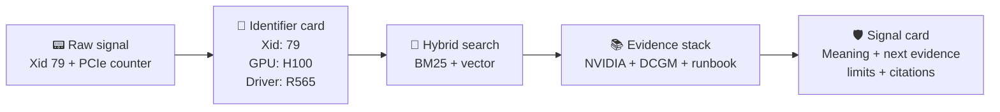
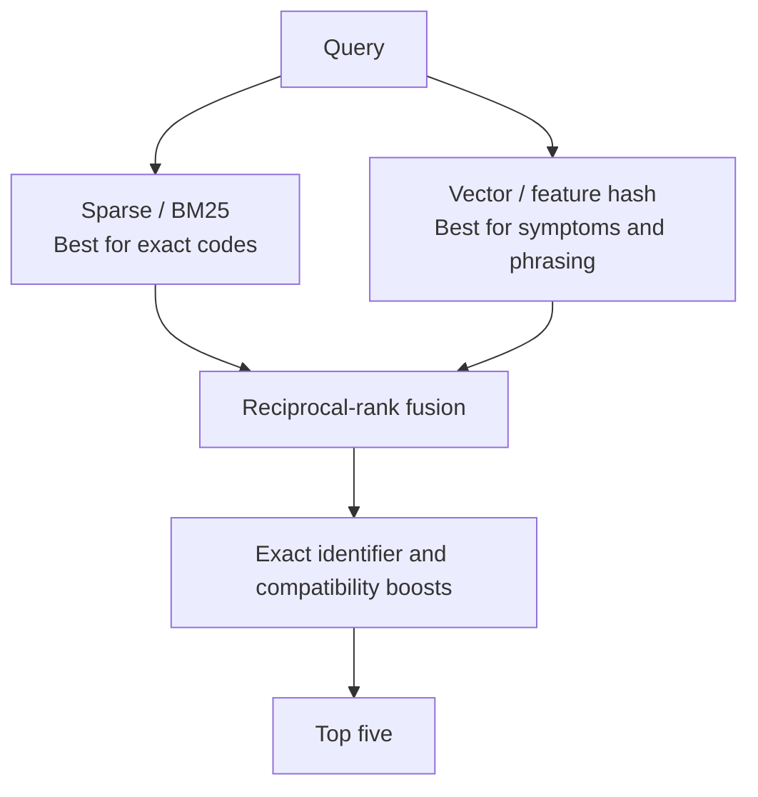
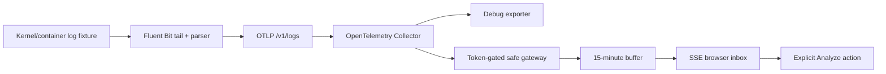
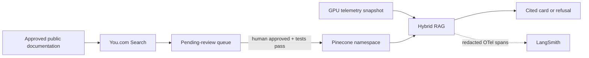

# Visual Guide: From GPU Event to Cited Signal Card

The public website includes an interactive nine-stage walkthrough. Click **Run full pipeline** to animate source ingestion, cleaning and freshness, structure-aware chunking, persistent indexing, signal extraction, dual retrieval, reranking, the evidence gate, and deterministic or optional schema-constrained generation. Every stage can be paused and selected directly.

It also includes a separate ten-component **Telemetry** visualization. **Guided replay** automatically advances from a synthetic GPU event through Fluent Bit, the OpenTelemetry Collector, safe gateway, browser inbox, evidence API, Pinecone/BM25 retrieval, evidence gate, and LangSmith. **Live telemetry** opens the real SSE stream, displays each sanitized envelope, and requires an explicit click before analysis. If the host buffers streaming responses, the badge changes to **Live HTTPS fallback** and the page polls the same sanitized ring-buffer contract.

This guide explains the project without requiring source-code familiarity.

## One-screen mental model



## Stage 1 — Raw telemetry

Example input:

```text
NVRM: Xid (PCI:0000:65:00): 79, GPU has fallen off the bus.
DCGM_FI_DEV_PCIE_REPLAY_COUNTER=184
GPU_MODEL=H100 DRIVER=R565 NODE=gpu-worker-07
```

At this point the application knows only what the text states. It does not know the root cause.

## Stage 2 — Identifier extraction

```text
┌───────────────────────┐
│ Extracted signal      │
├───────────────────────┤
│ Xid             79    │
│ DCGM field       PCIe │
│ GPU              H100 │
│ Driver           R565 │
└───────────────────────┘
```

Exact extraction prevents a semantic retriever from confusing Xid 79 with a nearby number or one DCGM counter with another.

## Stage 3 — Two retrieval views



The browser exposes both rank positions as `S` and `V`. A result shown as `S1 · V2` ranked first in sparse retrieval and second in vector retrieval.

## Stage 4 — Evidence selection

For the Xid 79 replay, the evidence stack can contain:

```text
1. NVIDIA Xid 79 catalog entry        [official]
2. DCGM PCIe replay-counter entry     [official]
3. PCIe evidence-bundle runbook       [internal]
```

The official definition leads the answer. The local runbook contributes evidence-gathering steps but cannot redefine the vendor event.

## Stage 5 — Signal card

```text
┌─────────────────────────────────────────────────────────────┐
│ Xid 79: GPU has fallen off the bus              GROUNDED   │
├─────────────────────────────────────────────────────────────┤
│ DOCUMENTED MEANING                                          │
│ Driver can no longer access the GPU over PCIe.               │
│                                                             │
│ COLLECT NEXT                 │ EVIDENCE BOUNDARY             │
│ • earlier Xids               │ • not a unique root cause     │
│ • PCIe/AER logs              │ • absolute counter ≠ rate     │
│ • enumeration state         │ • no reset is performed       │
│                                                             │
│ SOURCES                                                     │
│ [1] NVIDIA Xid Errors  [2] DCGM Fields  [3] Demo Runbook    │
└─────────────────────────────────────────────────────────────┘
```

The card is useful even when it does not diagnose the cause: it tells the operator what is known, what is not known, and which evidence closes the gap.

## Refusal path

An input such as `Xid 999` follows a different path:

```mermaid
sequenceDiagram
    participant U as User
    participant X as Extractor
    participant C as Corpus check
    participant A as Atlas
    U->>X: Xid 999 on H100
    X->>C: Does Xid 999 exist?
    C-->>A: No authoritative entry
    A-->>U: Refuse; request complete context
```

No semantically similar Xid is substituted. The response has zero citations and zero diagnostic claims.

## Implemented telemetry pipeline



This path now demonstrates both collection/normalization and a safe browser delivery boundary. The Collector still prints its debug copy, while a second exporter sends OTLP JSON to `app/api/telemetry/v1/logs`. The gateway authenticates external writes, rejects oversized bodies/batches, allow-lists metadata, redacts credentials and workload identifiers, and exposes a short-lived sanitized envelope over SSE or the labeled `/recent` HTTPS fallback. The browser never auto-analyzes an arriving event. The RAG evaluation remains independent so it can run on any laptop without Fluent Bit, a Collector, or a GPU.

## External intelligence and AI observability



The three lanes intentionally carry different data. You.com sees documentation discovery queries and public pages, not GPU telemetry. Pinecone stores approved documentation vectors, not submitted logs. LangSmith sees stage timing, ranks, identifiers, versions, and outcomes, not the raw telemetry string. In the current public deployment all three providers are configured; the website's **AI observability** section reads only safe configuration booleans and never receives provider keys.

## Source-code map

```text
Question: Where is the knowledge?
Answer:   core/corpus.ts

Question: Where does retrieval happen?
Answer:   core/engine.ts → retrieve()

Question: Where is refusal decided?
Answer:   core/engine.ts → analyzeTelemetry()

Question: Where are expected answers kept?
Answer:   evaluation/cases.ts

Question: Where are quality metrics computed?
Answer:   scripts/evaluate.ts

Question: Where is the interactive experience?
Answer:   app/page.tsx

Question: Where is the OTLP replay configured?
Answer:   observability/

Question: Where is telemetry normalized and sanitized?
Answer:   core/telemetry.ts

Question: Where are ingest, replay, recent, and SSE routes?
Answer:   app/api/telemetry/

Question: Where is governed You.com discovery implemented?
Answer:   core/you.ts → scripts/discover-you-sources.ts

Question: Where is redacted LangSmith export implemented?
Answer:   core/langsmith.ts → app/api/analyze/route.ts
```

## What the visual colors mean

| Color | Meaning |
|---|---|
| Mint green | Retrieved, grounded, active, or passed |
| Amber | Compatibility uncertainty, evidence gap, or refusal |
| Slate | Supporting context and neutral metadata |
| White | Primary documented fact |

## Final interpretation rule

```text
Telemetry signal + retrieved documentation ≠ proven root cause

Telemetry signal + cited meaning + missing-evidence list = safer investigation start
```
