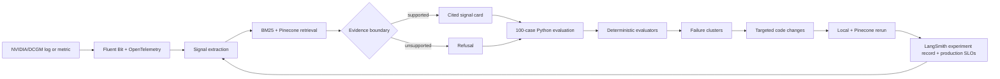

# Week 2 → Week 4 Product Mapping

GPU Signal Atlas uses one continuous product loop. Week 2 builds the evidence-grounded GPU observability application; Week 4 makes its quality measurable and uses failures to improve the same application.

## End-to-end flow

## Requirement-to-technology map

| Learning goal | Implemented product capability | Technology and evidence |
|---|---|---|
| Week 2: ingest a domain corpus | Reviewed NVIDIA Xid, DCGM, Fluent Bit, OpenTelemetry, and runbook records | Source allow-list, cleaner, fingerprints, freshness SLA, 17-record corpus |
| Week 2: retrieve relevant context | Exact identifiers survive semantic retrieval | BM25, deterministic 256d vectors, reciprocal-rank fusion, Pinecone serverless |
| Week 2: generate a grounded answer | Structured signal card cites only retrieved records | Deterministic template plus optional strict-schema Mistral mode |
| Week 2: handle unsupported input | Unknown Xids/metrics and unrelated or manipulated requests return no diagnosis | Evidence/refusal gate and instruction-manipulation guardrail |
| Week 2: evaluate RAG choices | Retrieval and chunking strategies are compared independently | Recall@5, MRR, retrieval/chunking ablations |
| Week 4: create evaluation data | Versioned v2 has 100 reviewed cases with independent expected evidence and behavior | JSONL, SHA-256 fingerprint, 50/30/15/5 scenario split |
| Week 4: build an evaluation system | Python invokes the TypeScript agent and scores each result | 10 checks: retrieval, status, extraction, primary evidence, citation, faithfulness, contract, refusal, guardrail, latency |
| Week 4: use evaluation to improve | 25 measured baseline failures map to five bounded changes | 75/100 baseline → 100/100 improved; 0 regressions |
| Week 4: observe experiments | Dataset and paired experiment records are registered; provider quota state is disclosed | LangSmith plus checked-in JSON/CSV/XLSX source-of-truth artifacts |
| Week 4: test production behavior | The identical v2 suite exercises managed retrieval | Pinecone 100/100, 100 read units, 346.1 ms p50, 790.6 ms p95 |

## What the 100% result means

The 100/100 result means the current deterministic agent satisfies every expectation in this frozen, reviewed regression set. It does not prove universal GPU root-cause accuracy. New production failure classes should be de-identified, reviewed, added as new labeled cases, measured against the current version, and promoted only after a controlled rerun.

