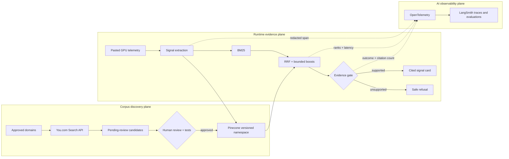

# You.com Discovery and LangSmith AI Observability

## Purpose

GPU Signal Atlas uses two optional integrations to improve corpus freshness and RAG quality without weakening its evidence boundary:

- **You.com Search API** discovers current public documentation from approved domains. Results become review candidates; they do not enter the operational corpus automatically.
- **LangSmith** receives redacted OpenTelemetry traces for the extraction, retrieval, evidence-gating, and generation path. The original pasted telemetry is not exported.

Pinecone remains the managed vector database for reviewed corpus records. Fluent Bit and OpenTelemetry remain the collection and normalization layer for logs and traces.

## End-to-end map



## Technology responsibilities

| Technology | Responsibility | Stored or transported artifact | Explicit boundary |
|---|---|---|---|
| Fluent Bit | Tail, parse, and enrich GPU/Kubernetes logs | OTLP log records | It is not a vector database or RAG engine. |
| OpenTelemetry | Normalize logs and represent RAG work as traces | OTLP logs and spans | Redaction happens before external trace export. |
| You.com | Discover current allow-listed public sources | Pending-review source candidates | No telemetry input and no automatic corpus promotion. |
| Pinecone | Serve dense candidates from approved corpus records | Versioned 256-dimensional vectors + metadata | Only reviewed records are synchronized. |
| LangSmith | Inspect RAG traces and support datasets/evaluators | Redacted timings, ranks, outcomes, and identifiers | No raw pasted telemetry by default. |

## You.com discovery workflow

The implementation is in `core/you.ts` and `scripts/discover-you-sources.ts`.

1. The operator supplies a documentation discovery query.
2. The adapter sends the query to You.com with an explicit domain allow-list: NVIDIA documentation, Fluent Bit documentation, OpenTelemetry documentation, and this public repository.
3. The adapter rejects non-HTTPS and non-allow-listed URLs a second time after the response.
4. Each accepted result receives a discovery timestamp, deterministic content hash, provider label, and `pending-review` status.
5. A reviewer compares the candidate with the existing curated meaning, source scope, and compatibility notes.
6. Only an approved change can rebuild the offline index, pass tests/evaluations, synchronize a new Pinecone namespace, and promote that namespace.

This two-gate design treats web discovery as an input to change control—not as authoritative runtime evidence.

## LangSmith trace workflow

The API route measures three child stages:

1. `rag.extract_signals`
2. `rag.hybrid_retrieval`
3. `rag.evidence_gate_and_generate`

`core/langsmith.ts` wraps them in a root `gpu-signal-atlas.analyze` span and exports OTLP/HTTP JSON when LangSmith is configured. Trace attributes include:

- recognized Xid/DCGM identifiers, GPU models, and driver branches;
- input length, but not the input text;
- corpus and vector-index versions;
- retrieval backend, candidate count, and stage latency;
- grounded/refused status, evidence strength, generation mode, and citation count; and
- `rag.raw_telemetry_exported=false` as an auditable privacy assertion.

The exporter is fail-open: disabled configuration or a LangSmith outage never blocks the user-facing analysis. The response diagnostic reports `exported`, `failed`, or `disabled`.

An alternative Collector configuration is in `observability/otel-collector-langsmith.yaml`. It removes generic `input.value` and `output.value` span fields before a debug/LangSmith fan-out.

## Configure locally

Copy `.env.example` to `.env.local` and set only the integrations you want:

```dotenv
YOU_API_KEY=...
YOU_SEARCH_ENDPOINT=https://api.you.com/v1/search

LANGSMITH_API_KEY=...
LANGSMITH_PROJECT=gpu-signal-atlas
LANGSMITH_OTEL_ENDPOINT=https://api.smith.langchain.com/otel/v1/traces
```

Keep both keys server-side. Do not prefix them with a browser-public variable name and do not commit `.env.local`.

Run a discovery query:

```bash
npm run discover:you -- "NVIDIA Xid 79 recovery action documentation"
```

The command prints review candidates as JSON and states `autoPromoted: false`. It intentionally does not edit `core/corpus.ts` or call Pinecone upsert.

Start the website and run a sample analysis:

```bash
npm run dev
```

When the LangSmith variables are present, the API response shows `observabilityExport: exported` on success. Without them it shows `disabled`, which is the expected optional-mode behavior.

For Collector-based trace fan-out:

```bash
otelcol-contrib --config observability/otel-collector-langsmith.yaml
```

## Tests and operational checks

```bash
npm test
npm run evaluate
npm run ablate
npm run typecheck
npm run lint
npm run build
```

The mocked integration tests verify allow-list filtering, review-only discovery status, OTLP headers, trace structure, optional configuration, failure isolation, and absence of the raw telemetry string.

Before enabling either integration in production:

- store keys in the hosting platform secret store;
- confirm LangSmith workspace retention, access control, and regional policy;
- sample exported traces and verify the redaction contract;
- add You.com quota and failure metrics;
- add LangSmith export success/failure counters;
- preserve the human promotion gate and Pinecone namespace rollback; and
- create dataset evaluators for retrieval relevance, citation validity, refusal correctness, and latency.

## Larger-corpus extension

For hundreds or thousands of sources, make discovery asynchronous and incremental:

1. Schedule allow-listed You.com queries by product, signal family, and document version.
2. Store candidates and diffs in an auditable review database.
3. Deduplicate by canonical URL and content hash.
4. Split approved documents with structure-aware chunking and parent-document metadata.
5. Embed only changed chunks and upsert into a staging Pinecone namespace.
6. Run offline regression and LangSmith dataset evaluation against the staging namespace.
7. Promote by changing one namespace configuration value; retain the previous namespace for rollback.

This preserves the current safety model while scaling discovery, review, evaluation, and vector serving independently.

## Official references

- [You.com Search API](https://you.com/docs/api-reference/search/v1-search)
- [LangSmith OpenTelemetry tracing](https://docs.langchain.com/langsmith/trace-with-opentelemetry)
- [LangSmith evaluation](https://docs.langchain.com/langsmith/evaluation)
- [LangSmith input/output masking](https://docs.langchain.com/langsmith/mask-inputs-outputs)
